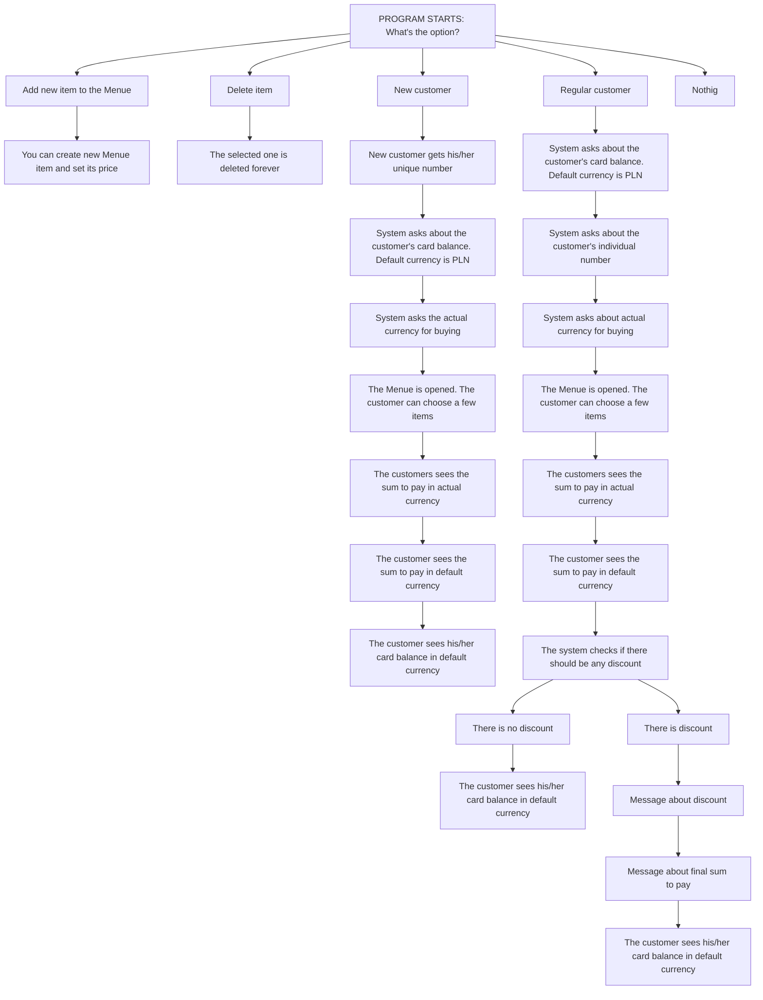

# CoffeeShop
Simplified control system for Menue and Customers' discounts.

For correct work all the files should be input to the same folder.

#### TO CHANGE THE MENUE ITEM'S PRICE
First delete the Menue item. Then create it again with a new price
